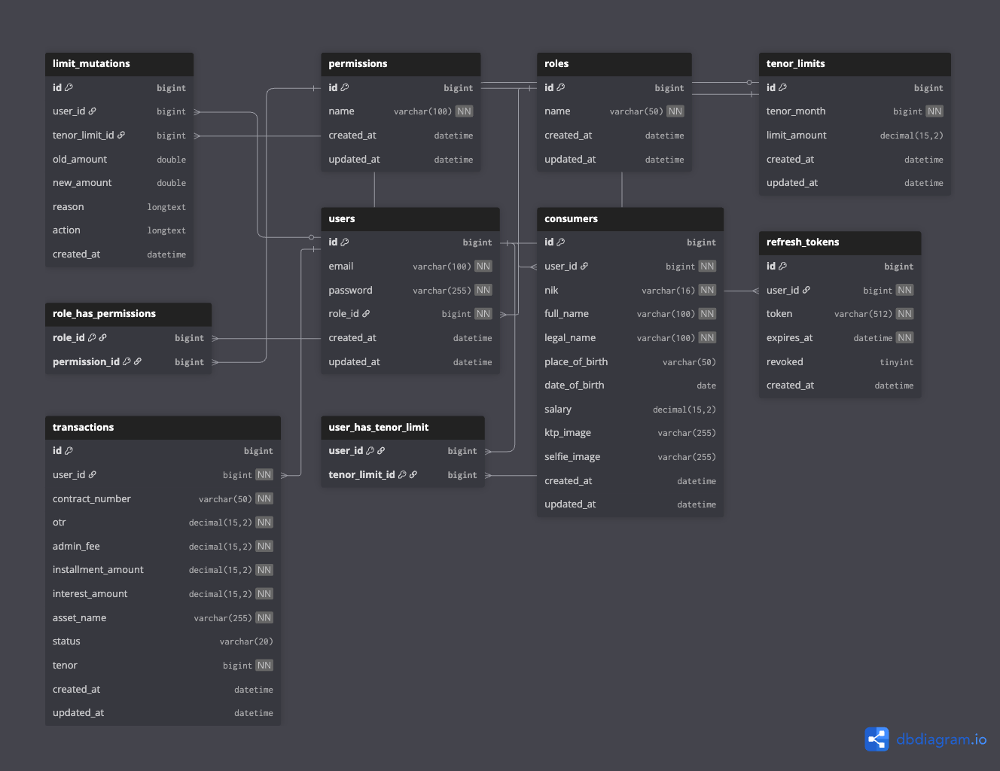

# XYZ Finance - Application Architecture

## Overview

XYZ Finance adalah backend API untuk aplikasi pembiayaan yang dibangun menggunakan Go dengan Gin Framework. Aplikasi ini menggunakan arsitektur layered (berlapis) dengan pola Repository Pattern.

## Layer Description

### 1. Client Layer
Klien yang dapat mengakses API:
- **Web Browser** - Akses via browser
- **Mobile App** - Aplikasi mobile (iOS/Android)
- **API Client** - Postman, curl, atau aplikasi lain

### 2. Docker Environment

#### API Container (Go Gin) - Port 8080

**Middleware Layer**
| Middleware | Fungsi |
|------------|--------|
| CORS | Cross-Origin Resource Sharing |
| Rate Limiter | Membatasi request per detik |
| Security Headers | Header keamanan HTTP |
| XSS Protection | Proteksi Cross-Site Scripting |
| API Key Auth | Validasi API Key |
| JWT Auth | Validasi JSON Web Token |
| Permission Check | Validasi RBAC permission |
| Request Logger | Logging setiap request |

**Handler Layer**
| Handler | Endpoint |
|---------|----------|
| Auth Handler | `/api/auth/*` |
| User Handler | `/api/user/*` |
| Limit Handler | `/api/limit/*` |
| Transaction Handler | `/api/transaction/*` |
| Log Handler | `/api/logs/*` |

**Service Layer**
| Service | Responsibility |
|---------|---------------|
| Auth Service | Login, Register, Password hashing |
| JWT Service | Token generation, validation, refresh |
| Limit Service | Tenor limit management |
| Transaction Service | Transaction creation, history |
| Log Service | Read log files |

**Repository Layer**
| Repository | Entity |
|------------|--------|
| User Repository | Users, Consumers |
| Limit Repository | TenorLimits |
| Transaction Repository | Transactions |
| RefreshToken Repository | RefreshTokens |
| LimitMutation Repository | LimitMutations |

#### MySQL Container - Port 3306
Database penyimpanan data utama dengan tabel:
- `users` - Data pengguna
- `consumers` - Data konsumen (NIK, nama, dll)
- `roles` & `permissions` - RBAC
- `tenor_limits` - Limit tenor per user
- `transactions` - Riwayat transaksi
- `limit_mutations` - Mutasi limit
- `refresh_tokens` - Token refresh JWT

### 3. File Storage

| Directory | Fungsi |
|-----------|--------|
| `/storage/logs` | Log files (audit.log, auth.log, system.log) |
| `/storage/uploads` | File uploads (KTP, selfie images) |

## Request Flow

```
Client Request
     ↓
┌─────────────────────────────────────────┐
│              MIDDLEWARE CHAIN           │
│  CORS → Rate Limit → Security → XSS     │
│  → API Key → JWT → Permission → Logger  │
└─────────────────────────────────────────┘
     ↓
┌─────────────────────────────────────────┐
│               HANDLER                   │
│  Parse Request → Validate Input         │
└─────────────────────────────────────────┘
     ↓
┌─────────────────────────────────────────┐
│               SERVICE                   │
│  Business Logic → Transaction Mgmt      │
└─────────────────────────────────────────┘
     ↓
┌─────────────────────────────────────────┐
│              REPOSITORY                 │
│  Data Access → SQL Queries              │
└─────────────────────────────────────────┘
     ↓
┌─────────────────────────────────────────┐
│               DATABASE                  │
│  MySQL - Data Persistence               │
└─────────────────────────────────────────┘
     ↓
JSON Response
```

## Security Architecture

```
                    ┌──────────────┐
                    │   Request    │
                    └──────┬───────┘
                           ↓
                    ┌──────────────┐
         ┌─ Fail ───│     CORS     │
         │          └──────┬───────┘
         ↓                 ↓ Pass
   403 Forbidden    ┌──────────────┐
         ┌─ Fail ───│  Rate Limit  │
         │          └──────┬───────┘
         ↓                 ↓ Pass
   429 Too Many     ┌──────────────┐
                    │   API Key    │
         ┌─ Fail ───│  Validation  │
         │          └──────┬───────┘
         ↓                 ↓ Pass
   401 Unauthorized ┌──────────────┐
         ┌─ Fail ───│     JWT      │
         │          │  Validation  │
         ↓          └──────┬───────┘
   401 Unauthorized        ↓ Pass
                    ┌──────────────┐
         ┌─ Fail ───│  Permission  │
         │          │    Check     │
         ↓          └──────┬───────┘
   403 Forbidden           ↓ Pass
                    ┌──────────────┐
                    │   Handler    │
                    └──────────────┘
```

## Database Schema

### Entity Relationships

    

### Tables

| Table | Description |
|-------|-------------|
| `users` | User accounts (email, password, role_id) |
| `consumers` | Consumer details (NIK, name, salary, KTP) |
| `roles` | User roles (admin, user) |
| `permissions` | Available permissions |
| `role_has_permissions` | Role-permission mapping |
| `tenor_limits` | Tenor limit configuration |
| `user_has_tenor_limit` | User-limit mapping |
| `transactions` | Transaction records |
| `limit_mutations` | Limit change history |
| `refresh_tokens` | JWT refresh tokens |

## Tech Stack Summary

| Component | Technology |
|-----------|------------|
| Language | Go 1.25+ |
| Framework | Gin |
| Database | MySQL 8.0 |
| ORM | GORM |
| Auth | JWT + API Key |
| Logging | Zerolog |
| Container | Docker |
| Orchestration | Docker Compose |

## Performance Benchmark

Hasil load testing menggunakan k6 dengan skenario: **Smoke (1 VU)**, **Load (10 VUs)**, **Stress (20 VUs)**.

> **Note:** BCrypt cost 8 (dev) + Redis permission caching (TTL 5 min).

### Response Time

| Endpoint | Average | p95 | p99 |
|----------|---------|-----|-----|
| Login | 38ms | 49ms | 67ms |
| Get Profile | 5ms | 16ms | 20ms |
| Get Limits | 8ms | 17ms | 25ms |
| Get Transactions | 16ms | 29ms | 35ms |
| Create Transaction | 14ms | 34ms | 40ms |

### Throughput & Reliability

| Metric | Value |
|--------|-------|
| Requests/second | 21 req/s |
| Success Rate | 100% |
| Error Rate (app logic) | 0% |
| Total Iterations | 1,521 |
| Duration | 6 minutes |

### Test Configuration

```bash
# Run performance test
k6 run performance-test.js

# With custom environment
BASE_URL=http://localhost:8080 API_KEY=your-key k6 run performance-test.js
```

### Thresholds (SLA)

| Metric | Threshold | Result |
|--------|-----------|--------|
| http_req_duration p(95) | < 500ms | ✅ 43ms |
| http_req_duration p(99) | < 1000ms | ✅ 67ms |
| Login p(95) | < 300ms | ✅ 49ms |
| Get Profile p(95) | < 200ms | ✅ 16ms |
| Get Limits p(95) | < 200ms | ✅ 17ms |
| Get Transactions p(95) | < 300ms | ✅ 29ms |
| Create Transaction p(95) | < 500ms | ✅ 34ms |

### Performance Optimization Applied

| Optimization | Before | After | Improvement |
|--------------|--------|-------|-------------|
| BCrypt Cost (10→8) | 98ms login | 40ms login | ⬇️ 59% faster |
| Redis Permission Cache | 40ms login | 38ms login | ⬇️ 5% faster |
| **Total** | **98ms** | **38ms** | **⬇️ 61% faster** |

